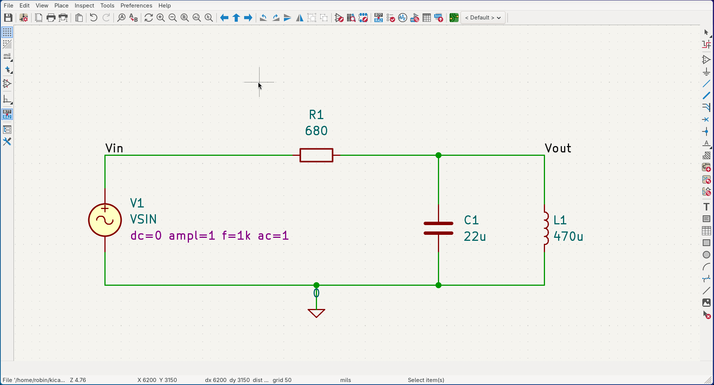
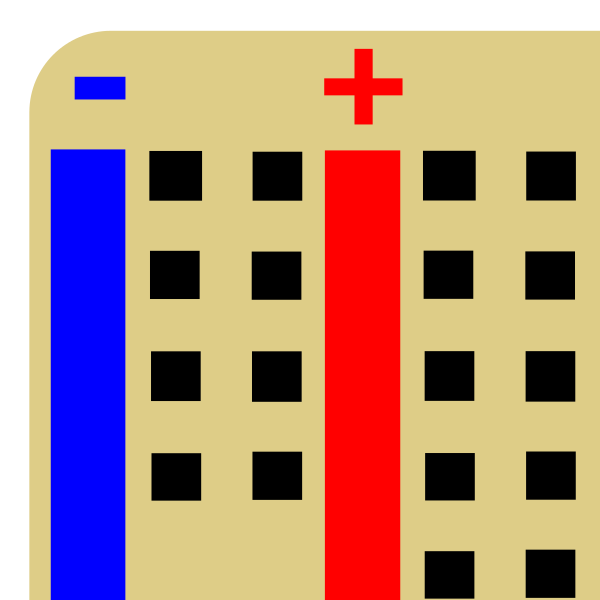
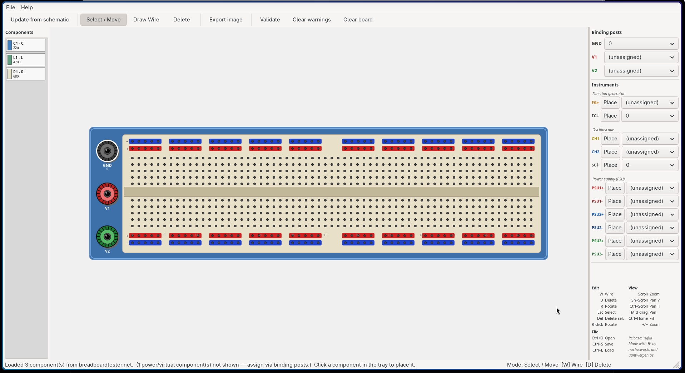
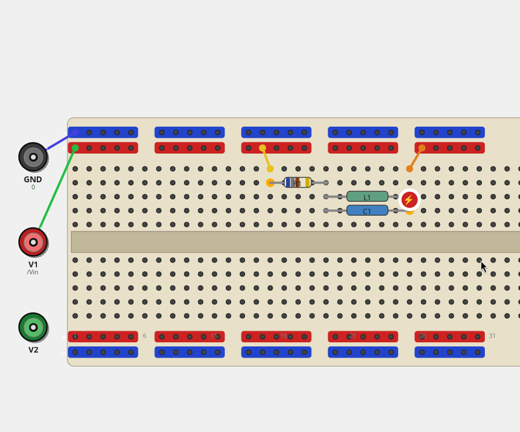

# KiCad Breadboard Builder

A KiCad 9 / 10 Action Plugin for introductory analog electronics courses at the University of Antwerp. Students draw a schematic in Eeschema, then use this plugin to wire up the same circuit on a virtual 830-point breadboard — placing components, drawing jumper wires, and validating their work against the schematic.

## What it does

- Renders an 830-point breadboard (63 columns × rows a–j, four power rails, three binding posts: GND / V1 / V2)
- Parses a KiCad S-expression netlist and shows all placeable components in a side tray
- Two-step placement for 2-pin components: click pin 1, then click pin 2
- Single-click placement for DIP ICs and 3-pin components (BJT, POT)
- Draw jumper wires between any two holes (tie strip, rail, or binding post)
- Validate the board against the schematic: highlights open nets (?) and shorts (⚡)
- Export the board as a PNG image
- "Update from schematic" re-exports the netlist via `kicad-cli` without leaving the window
- Save and load board sessions (`.kicad_bbrd`)
- Instrument probes: place function-generator and oscilloscope connection points on the board; drag their labels freely for better visibility

## Supported components

| Component | Package |
|---|---|
| Resistor (with colour bands) | Axial |
| Capacitor, electrolytic capacitor | Radial |
| Inductor | Axial |
| Diode, Zener diode | Axial (1N4001 style) |
| LED | 5 mm round |
| Potentiometer | 3-pin |
| NPN / PNP BJT | TO-92 |
| N / P-channel JFET | TO-92 |
| BS170 MOSFET | TO-92 |
| TL081 (single), RC4558 (dual), TL084 (quad) op-amp | DIP-8 / DIP-14 |
| OPAMP (KiCad Simulation_SPICE) | Logical 5-pin |

---

## Installation in KiCad 9 or 10

### Step 1 — Clone the repository

```bash
git clone https://github.com/kerstensrobin/kicad-breadboard.git
```

### Step 2 — Link the plugin into KiCad's scripting folder

The scripting plugin directory depends on your KiCad version and operating system.
Replace `<version>` with `9.0` or `10.0` to match your installation.

| Platform | KiCad 9 | KiCad 10 |
|---|---|---|
| Linux | `~/.local/share/kicad/9.0/scripting/plugins/` | `~/.config/kicad/10.0/scripting/plugins/` |
| macOS | `~/Library/Preferences/kicad/9.0/scripting/plugins/` | `~/Library/Preferences/kicad/10.0/scripting/plugins/` |
| Windows | `%APPDATA%\kicad\9.0\scripting\plugins\` | `%APPDATA%\kicad\10.0\scripting\plugins\` |

> If you are unsure of the exact path, open KiCad and go to **Preferences → Configure Paths…** — the scripting plugin directory is listed there.

**Linux / macOS (adjust path for your version):**
```bash
# KiCad 9
ln -s /path/to/kicad-breadboard/plugins/breadboard \
      ~/.local/share/kicad/9.0/scripting/plugins/breadboard

# KiCad 10
ln -s /path/to/kicad-breadboard/plugins/breadboard \
      ~/.config/kicad/10.0/scripting/plugins/breadboard
```

**Windows** (run PowerShell as Administrator, adjust version number):
```powershell
New-Item -ItemType Junction `
  -Path  "$env:APPDATA\kicad\10.0\scripting\plugins\breadboard" `
  -Target "C:\path\to\kicad-breadboard\plugins\breadboard"
```

Or simply **copy** the `plugins/breadboard/` folder into the scripting plugins directory if you do not want a symlink.

### Step 3 — Refresh plugins in KiCad

1. Open KiCad and open any project in the **PCB Editor** (pcbnew).
2. In the menu: **Tools → External Plugins → Refresh Plugins**.
3. A breadboard icon appears in the right-hand toolbar (or under **Tools → External Plugins → Breadboard Builder**).

> The plugin registers as an Action Plugin and only appears inside the PCB Editor, not the schematic editor — this is a KiCad limitation for Python plugins.

### Step 4 — Open your project

Click the toolbar button (or menu entry). The plugin will automatically find the netlist (`.net`) in the same folder as the open PCB file.

If you have not exported a netlist yet, use **"Update from schematic"** in the toolbar — this calls `kicad-cli` to export one automatically. `kicad-cli` ships with KiCad 9 and 10 and is on the PATH when KiCad is installed normally.

---

## Standalone mode (development / no KiCad needed)

> **Note:** Standalone mode is intended for UI development only.
> The **"Update from schematic"** feature requires `kicad-cli` (part of a KiCad 9 installation) and will not work in standalone mode.
> For the full workflow — drawing a schematic, exporting a netlist, and validating a breadboard build — use the plugin inside KiCad as described above.

```bash
pip install wxPython
cd /path/to/kicad-breadboard
python -m plugins.breadboard.standalone path/to/circuit.net
```

---

## Toolbar buttons

| Button | Action |
|---|---|
| Open netlist | Load a `.net` file manually |
| Update from schematic | Re-export netlist from `.kicad_sch` via `kicad-cli` and reload *(requires KiCad project; not available in standalone mode)* |
| Export image | Save the current board view as a PNG |
| Signal labels | Toggle net signal labels on the board |
| Validate | Check if the breadboard matches the schematic |
| Clear warnings | Dismiss `?` / `⚡` validation markers |
| Clear board | Remove all placed components and wires |

## Hotkeys

| Key | Action |
|---|---|
| W | Wire mode |
| D | Delete mode |
| R | Rotate DIP IC or TO-92 / POT 180° (during placement or when selected) |
| Esc | Back to Select / Move mode |
| Del | Delete selected component or wire |
| Right-click on DIP | Rotate 180° |
| Right-click on binding post | Assign to schematic net |
| Ctrl+S | Save session |
| Ctrl+L | Load session |
| Scroll | Zoom in / out |
| Shift+Scroll | Pan vertical |
| Ctrl+Scroll | Pan horizontal |
| Middle drag | Pan |
| Ctrl+Home | Fit view |

---

## Side panel

### Binding posts

Three binding posts (GND, V1, V2) on the left of the board can be assigned to schematic nets via the dropdowns. GND is automatically assigned to net `0` when a netlist is loaded. The validator treats an assigned binding post as an electrical endpoint on that net.

### Instruments

The **Function generator** and **Oscilloscope** sections let you place optional probe markers on any hole. Each probe can be assigned to a schematic net independently of the binding posts.

| Probe | Instrument |
|---|---|
| FG+ | Function generator signal |
| FG⏚ | Function generator ground |
| CH1 | Oscilloscope channel 1 |
| CH2 | Oscilloscope channel 2 |
| SC⏚ | Oscilloscope ground |

- Click **Place** to enter placement mode, then click any hole on the board.
- Click **Remove** (same button once placed) to remove the probe.
- In **Delete mode** (D), hover over a probe flag and click to remove it.
- In **Select mode**, drag a probe flag to reposition the label. A leaderline connects the label back to its hole. The label position is saved in the session file.

---

## Example workflow

- Draw a schematic.



- Go to the PCB editor (using the green button on the toolbar, or by using Tools → Switch to PCB editor)



At the top, a new breadboard icon appeared (in the toolbar, next to the CLI input icon). Clicking this will take you to the Breadboard editor.



Here, you can select which component you want to place and click "Validate" to check if your build contains errors. If it does, it will indicate missing connections and short circuits on the relevant pins as illustrated below.



That's it! Have fun!

Robin
